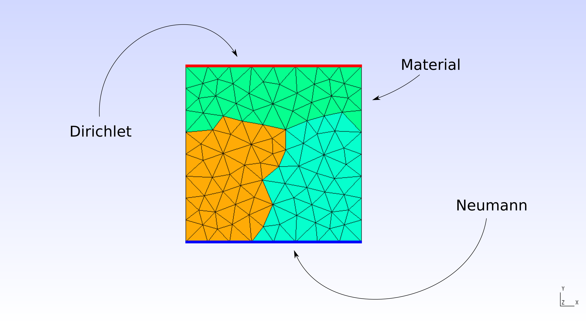
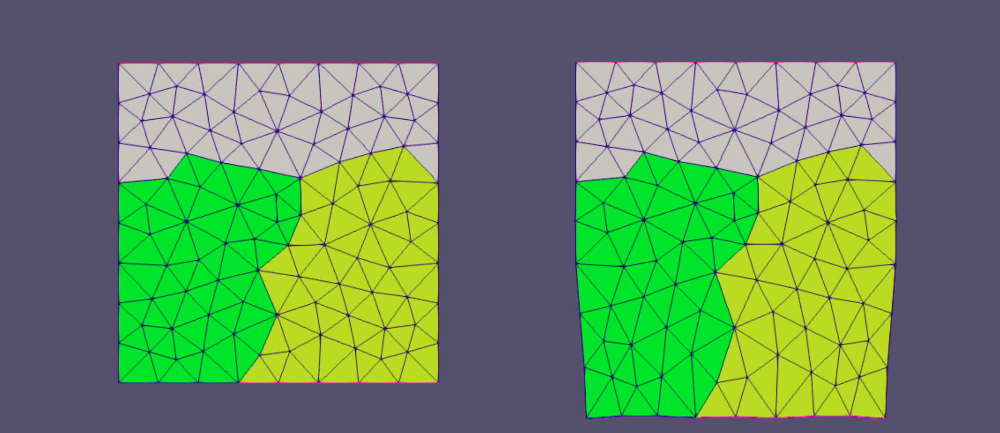

==============================
Linear Dynamic 2D Example
==============================

We are going to solve a linear dynamic system using the FETI linear dynamic solver in this example. We decided to
use an aluminium rectangular 2D structure, which is going to be fixed on the north edge and a triangular force
with a peak of 30kN, for 0.005sec.
This structure will be meshed and partitioned into three substructures using gmsh (version: 3.0.6).

Note that the Python script for this example is available in ``docs/chapters/examples/linear_dynamic_2d_example.py``.
Remember that you need to have AMfeti and AMfe installed in order to use the functions we use here. Also remember
to update the absolute mesh- and output-paths according to your folder structure.

Preprocessing
===============

When creating your geometries, make sure to add physical groups for every boundary
condition of your problem as well as a physical group for the whole
geometry that will be used to impose the material properties and name them
accordingly. If you are not familiar
with physical groups you can check out the ``.geo`` files, we provide in
the ``docs/chapters/examples/meshes``, where the
physical groups can be found towards the end of the script.

We have three physical groups:

* "dirichlet" - for a Dirichlet boundary on the north edge,

* "neumann" - for a Neumann boundary on the south edge,

* "material" - for the material on the whole 2D surface.

Finally, the mesh was partitioned into three substructures, which are shown with different colors in the image below.

|

|

Now that we have our mesh, we need to prepare it using Python before passing it to the
AMfeti solver. We start by importing the libraries needed for this example.

Afterwards, we are setting up the material properties and defining our component with the mesh file.
It's important to remember to set the parameter of ``surface2partition`` to ``True`` when reading the mesh.

We proceed by assigning the material properties and
mapping the global degrees of freedom for all nodes that lie on the Dirichlet boundary.
This mapping will be used to assign the Dirichlet constraints later.

We define a structural composite object with the help of the tree builder
that manages the substructures and the connections between them.

Then we define a triangular force that is applied from
time=0.0s until time=0.004s with a peak of 50kn at time=0.002s and apply the Neumann boundary condition
on the physical group of choice. Finally, we apply the Dirichlet conditions as well.

FETI Solver
=============

Now that we have finalized the structural composite, we can create a multicomponent mechanical system, i.e. a system
consisting of substructures.

Since this is a linear dynamic problem, we'd like to use the LinearDynamicFetiSolver.

However, this solver requires a dictionary of integrator objects, which are not directly
provided by the MulticomponentMechanicalSystem and needs to be created and wrapped into that
dictionary first. Such an integrator object describes the local dynamic behaviour.
Moreover a dictionary containing the B matrices and starting values for the local solutions as well as their
first and second time derivatives are required. For this purpose, we need to
write a function that prepares these dictionaries, we need to pass to the FETI solver.

We can now use this function to define the dictionaries for the integrator objects,
which are not directly provided by the MulticomponentMechanicalSystem and needs
to be created and wrapped into that dictionary first. Such an integrator object
describes the local dynamic behaviour. Moreover dictionaries for the
B matrices, the local solutions and their first and second derivatives and call the
linear static FETI solver. We're also passing the initial time=0.0s and final
time=0.005s as start- and end-time to the LinearDynamicFetiSolver.

A solution object, containing all global solutions, solver-information and local problems, is returned by the solver.

Postprocessing
===============

We now have our solution, but it's a solution object so we need to read it out and store the solution in a
way that is readable to us. We are going to create ``.hdf5`` and ``.xdmf`` files that contain the results.

Finally, we can take a look at the solution. For this, we use Paraview (version: 5.7.0). The original 2D object can be seen on the left
and the deformed 2D object can be seen on the right.

|