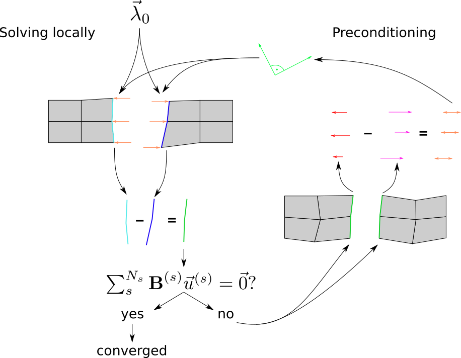

===============
The FETI Solver
===============

The FETI solver implements the idea presented in the theory with the help of parallelization.
The domain is decomposed into substructures and distributed on multiple processing units
with the goal of accelerating the computational process. Since the subdomains are connected
to each other, the interface forces need to be considered for every subdomain.

The interface problem which is a result of preconditioning the system of equations is formulated as:

.. math::
    F_{I} \lambda = d

with the help of a projector :math:`P`, i.e. we solve the interface problem
with a Preconditioned Conjugate Projected Gradient (PCPG) algorithm.

Solving the interface problem requires projecting the residual
:math:`r^{k}` with the projector :math:`P`, that removes
rigid-body-modes from the residual. To improve convergence, we use
a preconditioning step, which is usually evaluated locally and
in order to ensure global compatibility scaling is also needed.

After preconditioning, re-scaling and re-projecting are introduced to preserve
symmetry and insure that each iteration is independent of the particular choice
of the generalized inverse :math:`K^{*}`.

In order to describe the FETI algorithm, we define a residual :math:`r^{k}` and
a projected residual :math:`w^{k}` as:

.. math::
    r^{k} &= d - F_{I} \lambda^{k} \\
    w^{k} &= P d - P F_{I} \lambda^{k} \\
          &= P ( d - F_{I} \lambda^{k} ) \\
          &= P r^{k}

We present an algorithm for the basic iterative FETI solver:

1. Initialize
    .. math::

        \lambda^{0} &= G_{I} ( G_{I}^{T} G_{I} ) ^{-1} e \\
        r^{0} &= d - F_{I} \lambda^{0} \\

2. Iterate over :math:`k=1,2, ...` until convergence
    .. math::
        \begin{align}
        Project       \ \ \ \ \ \  w^{k-1} &= P^{T} r^{k-1}\\
        Scale         \ \ \ \ \ \  \overline w^{k-1} &= W^{-1} w^{k-1}\\
        Precondition  \ \ \ \ \ \  z^{k-1} &= \overline F_{I}^{-1} \overline w^{k-1}\\
        Re-scale      \ \ \ \ \ \  \overline z^{k-1} &= W^{-1} z^{k-1}\\
        Re-project    \ \ \ \ \ \  y^{k-1} &= P \overline z^{k-1}\\
        \\
        &if \ \ [k=1] \ :\\
        & \ \ \   \zeta^{1} = 0 \\
        & \ \ \   p^{1} = y^{0} \\
        &else: \\
        & \ \ \   \zeta ^{k} = y^{k-1^{T}} w^{k-1} / y^{k-2^{T}} w^{k-2} \\
        & \ \ \   \ p^{k} = y^{k-1} + \zeta^{k} p^{k-1} \\
        \\
        \nu^{k} &= y^{k-1^{T}} w^{k-1} / p^{k^{T}} F_{I} p^{k} \\
        \lambda^{k} &= \lambda^{k-1} + \nu^{k} p^{k} \\
        \ r^{k} &= r^{k-1} - \nu^{k} F_{I} p^{k} \\
        \\
        \end{align}

:math:`F p^{k}` is the critical point for parallel implementation,
because :math:`p^{k}` as the current Lagrange-Multiplier is broadcast
to the subdomains, which then answer with their obtained solutions
and a gap-residual is assembled.

In other words, the continuity of the solution which will be obtained
when the problem is parallelized is going to be ensured when
:math:`F p^{k}` is communicated between individual processors that
are computing individual subdomains.

Preconditioned Conjugate Projected Gradient (PCPG)
^^^^^^^^^^^^^^^^^^^^^^^^^^^^^^^^^^^^^^^^^^^^^^^^^^

The Conjugate Gradient (CG) method is used for solving minimization problems where
the Hessian matrix is not available or is very computationally expensive.
The main advantage of the CG method is that it can efficiently converge
to a solution, without repeating any of the directions taken, i. e. always
moving in a direction orthogonal to all previous ones.

We start with an initial value :math:`\lambda_{0}`
(which satisfies the constraint :math:`G^{T} \lambda_{0} = e`).
Each iterate :math:`\lambda_{k}` can be decomposed as the sum
of two components: :math:`\lambda_{k}^{1}` and :math:`\lambda_{k}^{2}`.
Then we can use an orthogonal projector :math:`P` and project this onto
the substructures. Afterwards we can compare and adjust the conditions
along the connections of substructures. Then we move on to a preconditioning step
and start a new iteration with a new :math:`\lambda`.

|

|

Generalized Minimal RESidual (GMRES) Method
^^^^^^^^^^^^^^^^^^^^^^^^^^^^^^^^^^^^^^^^^^^

The GMRES method is used for solving non-symmetric linear systems.
It is an extension of the MINimal RESidual method (MINRES) which can only
be used for symmetric linear systems. A disadvantage of this method is
that it is more expensive in terms of memory than conjugate gradient methods.

Preconditioning
^^^^^^^^^^^^^^^^

Preconditioning is used in order to give the numerical iterative solvers a good starting point.
For the FETI method specifically, different preconditioners
have been developed.

* Dirichlet preconditioner
    .. math::
        \overline F^{D^{-1}} = \sum_{s=1}^{s=N_{s}} B^{(s)}
        \begin{bmatrix} 0 & 0 \\
                        0 & S_{bb}^{(s)}
        \end{bmatrix}
        B^{(s)^{T}}
        =
        \sum_{s=1}^{s=N_{s}} B^{(s)}
        \begin{bmatrix} 0 & 0 \\
                        0 & K_{bb}^{(s)} - K_{ib}^{(s)} {K_{ii}^{(s)}}^{-1} K_{ib}^{(s)}
        \end{bmatrix}
        B^{(s)^{T}}

    where internal boundary unknowns are noted with
    the index :math:`i` and interface boundary
    unknowns are noted with the index :math:`b`.
    The matrix :math:`S_{bb}` denotes the primal
    Schur complement.
    This preconditioner is mathematically optimal,
    meaning it corresponds to the inverse of :math:`F`.

* 'lumped' preconditioner
    .. math::
        \overline F^{L^{-1}} = \sum_{s=1}^{s=N_{s}}  B^{(s)}
        \begin{bmatrix} 0 & 0 \\
                        0 & K_{bb}^{(s)}
        \end{bmatrix}
        B^{(s)^{T}}

    where the :math:`\overline F^{L^{-1}}` preconditioner
    is not mathematically optimal.

* lumped - Dirichlet preconditioner
    .. math::
        \overline F^{LD^{-1}} = \sum_{s=1}^{s=N_{s}} B^{(s)}
        \begin{bmatrix} 0 & 0 \\
                        0 & S_{bb}^{(s)^{*}}
        \end{bmatrix}
        B^{(s)^{T}}
        =
        \sum_{s=1}^{s=N_{s}} B^{(s)}
        \begin{bmatrix} 0 & 0 \\
                        0 & K_{bb}^{(s)} - K_{ib}^{(s)} diag(K_{ii}^{(s)})^{-1} K_{ib}^{(s)}
        \end{bmatrix}
        B^{(s)^{T}}

    where internal boundary unknowns are noted with
    the index :math:`i` and interface boundary
    unknowns are noted with the index :math:`b`
    and the :math:`diag(K_{ii}^{(s)})` term should
    be interpreted as taking only the values along
    the diagonal of the matrix :math:`K_{ii}^{(s)}`.

* superlumped preconditioner
    .. math::
        \overline F^{SL^{-1}} = \sum_{s=1}^{s=N_{s}}  B^{(s)}
        \begin{bmatrix} 0 & 0 \\
                        0 & diag(K_{bb}^{(s)})
        \end{bmatrix}
        B^{(s)^{T}}

    where the :math:`diag(K_{ii}^{(s)})` term should be interpreted as taking only the
    values along the diagonal of the matrix :math:`K_{ii}^{(s)}`.
