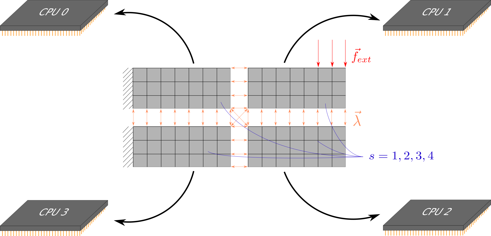
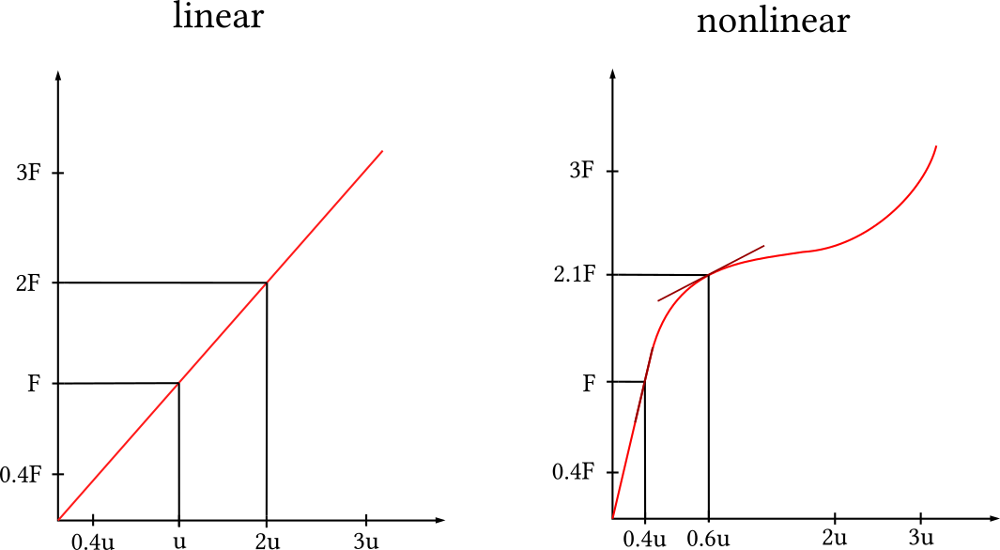
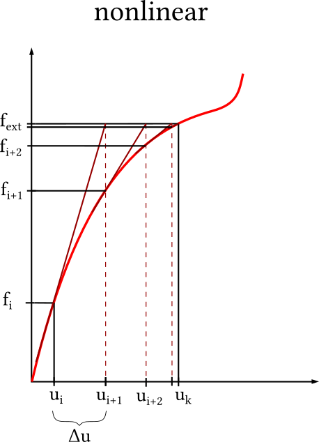
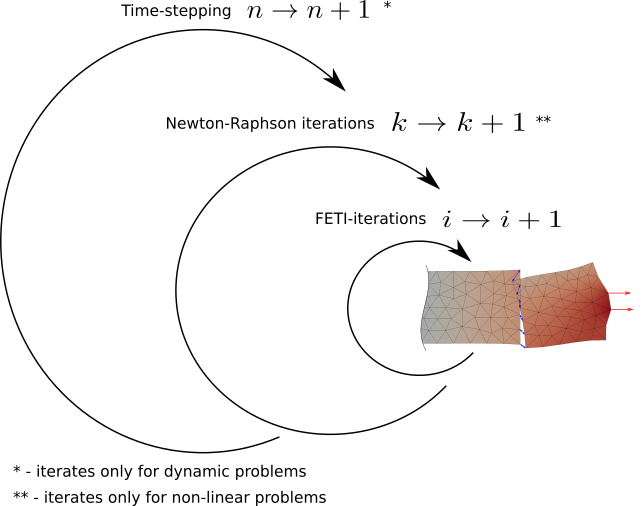

====================
Theory behind AMfeti
====================

Non-overlaping domain decomposition
===================================

The Finite Element Tearing and Interconnecting (FETI) method is
a domain decomposition method that consists of
"tearing apart" a domain into subdomains and then "gluing"
together the subdomains by applying the necessary
forces between neighbouring subdomains.

The FETI method is a non-overlapping
domain decomposition method for solving systems of linear equations.
The domain decomposition consists of splitting along the elements' edges to obtain
subdomains. The subdomains can then be solved independently on separate processing units.
The continuity of the solution is enforced with Lagrange-Multipliers.
This type of decomposition leads to a minimal set of Lagrange-Multipliers,
which are the only necessary communication between processors.

|

|
The AMfeti solvers are an attractive option for large-scale problems that also require
a high level of precision and computational performance. The AMfeti library offers
easy to implement functions and a good degree of customizability.

Formulation of structural mechanics problems
=============================================

The problem to be solved involves finding a solution to the following global problem.

.. math::
    K u = f \\

Where :math:`K` can be thought of as a stiffness matrix,
:math:`u` as the displacement vector and :math:`f` as the
prescribed force(s) vector.

In the FETI method, the domain is decomposed into substructures
and it is necessary to solve this problem for every substructure
separately. We are going to use the :math:`(s)` notation to
indicate that we are solving for a substructure.

:math:`s = 1, . . . , N_{s}` where :math:`N_{s}` is the
number of disconnected substructures.

Due to the expensive computational nature of solving for
:math:`u`, we start by reformulating the problem.

With the help of a boolean (inter-)connectivity matrix :math:`B`,
which ensures that every substructure takes only it's neighbouring
substructures into consideration,
we can focus on solving the following problem.

.. math::
    K^{(s)} u^{(s)} + B^{(s)^{T}} \lambda &= f^{(s)}\\
    \sum_{s=1}^{N_{s}} B^{(s)}u^{(s)} &= 0 \\

These mathematical expressions state that the substructure
problems are in equilibrium when the Lagrange multipliers
:math:`\lambda` are applied on the interface boundaries and
that the substructure displacement fields are compatible
on the interface boundaries.

This can be expressed in the following matrix form:

.. math::
    \begin{bmatrix} K^{(1)} & 0 & 0 & . & . & 0 & B^{(1)^{T}} \\
                    0 & K^{(2)} & 0 & . & . & 0 & B^{(2)^{T}} \\
                    0 & 0 & . & . & . & . & . \\
                    . & . & . & . & . & . & . \\
                    . & . & . & . & . & 0 & . \\
                    0 & 0 & . & . & 0 & K^{(N_{s})} & B^{(N_{s})^{T}} \\
                    B^{(1)} & B^{(2)} & . & . & . & B^{(N_{s})} & 0
    \end{bmatrix}
    \begin{bmatrix} u^{(1)} \\
                    u^{(2)} \\
                    . \\
                    . \\
                    . \\
                    u^{(N_{s})} \\
    \lambda \end{bmatrix}
    =
    \begin{bmatrix} f^{(1)} \\
                    f^{(2)} \\
                    . \\
                    . \\
                    . \\
                    f^{(N_{s})} \\
    0 \end{bmatrix}

We remind the reader that in the FETI solver, the problem
is being solved for each substructure separately.

The expression above can be compactly written as

.. math::
    \begin{bmatrix} K & B^{T} \\
                    B & 0
    \end{bmatrix}
    \begin{bmatrix} u \\
    \lambda \end{bmatrix}
    =
    \begin{bmatrix} f \\
    0 \end{bmatrix}

Where :math:`K` is a block diagonal matrix consisting of :math:`K^{(s)}` and
:math:`B, u, f` are vectors consisting of :math:`B^{(s)}, u^{(s)}, f^{(s)}`
values respectively.

In the case of floating substructures (i. e. substructures with insufficient constraints)
the matrix :math:`K^{(s)}` is singular due to local rigid body modes.
Such problems are solvable if the following requirement is fulfilled.

.. math::
    \left( f^{(s)} - B^{(s)^{T}} \lambda \right) ⊥ Ker \left( K^{(s)} \right) \ \ \ with \ \ \ s = 1, . . . , N_{f}

Then, the solution for :math:`u^{(s)}` can be computed with

.. math::
    u^{(s)} = K^{(s)^{*}} \left( f^{(s)} - B^{(s)^{T}} \lambda \right) + R^{(s)} \alpha^{(s)}

Where :math:`K^{(s)^{*}}` is a generalized inverse of :math:`K^{(s)}` ,
:math:`R^{(s)}=Ker \left( A^{(s)} \right)` and :math:`\alpha^{(s)}` is a vector
that contains the additional degrees of freedom, that can be viewed as amplitudes
of local rigid body modes.

Using the compatibility equation and the self-equilibrium equation,
we can write the dual interface equilibrium equation as:

.. math::
    \begin{bmatrix} F & -G \\
                     -G^{T} & 0
    \end{bmatrix}
    \begin{bmatrix} \lambda  \\
    \alpha
    \end{bmatrix}
    =
    \begin{bmatrix} d \\
    - e \end{bmatrix}

Where :math:`F = \sum_{s=1}^{s=N_{s}} B^{(s)}K^{(s)^{*}}B{(s)^{T}}`,
:math:`G = -R^{T} B^{T}`,
:math:`d = \sum_{s=1}^{s=N_{s}} B^{(s)} K^{(s)^{*}} f^{(s)}`
and :math:`e =- R^{T} f`

Solution Methods
================

The FETI algorithm can be used for linear or nonlinear problems that
can be static or dynamic. In the static case, the dual problem is
solved independent of time. In the dynamic case a static problem
is being solved at each step in time.

We differentiate between linear and nonlinear problems, where linear
problems are characterized by a linear relationship between the force and
the displacement, and nonlinear problems are characterized by a nonlinear
relationship between the force and the displacement.
Nonlinearities arise due to material properties or certain complex geometries.
We observe that the linear problem is much more simple than
the nonlinear problem with the following illustration.

|

|

Obviously, the slope remains constant for the linear problem,
and is changing for the nonlinear problem.
With this in mind, we can write down the relationship between
the displacement :math:`u` , the Lagrange multipliers :math:`\lambda`
and the external forces :math:`f_{ext}` as a function.

.. math::
    &linear  \ problem: \\
    &func \left( u^{(s)}, \lambda \right) = 0 \\
    &K^{(s)} u^{(s)} + B^{(s)^{T}} \lambda - f_{ext}^{(s)}= 0\\
    \\
    &nonlinear \ problem: \\
    &func \left( u^{(s)}, \lambda \right) = 0 \\
    &f_{int} \left( u^{(s)} \right) + B^{(s)^{T}} \lambda - f_{ext}^{(s)}= 0\\

Obviously, we cannot use the same solution strategy for both
the linear and the nonlinear problem, so we need a new technique
for the nonlinear problem.

We begin with the assumption that we know the external force,
as well as the initial displacement with the corresponding initial
internal force. The goal is to find the final displacement.

A relatively simple and common way to approximate functions
is with the help of the Taylor expansion. If we do a first-order Taylor
series expansion of :math:`f_{int}` at :math:`u_{i+1}^{(s)}` we get:

.. math::

    f_{int} \left( u_{i+1}^{(s)} \right) = f_{int} \left( u_{i}^{(s)} \right) +
    \frac {\partial {f_{int} \left( u_{i}^{(s)} \right) }} {\partial {u_{i}^{(s)}}}
    \left( u_{i+1}^{(s)} - u_{i}^{(s)} \right) = f_{ext}^{(s)} \\

This can also be seen as a linearization of the nonlinear problem above.
Now, we can solve for :math:`u_{i+1}^{(s)}`.

.. math::
    u_{i+1}^{(s)} = u_{i}^{(s)} + \left(f_{ext}^{(s)} - f_{int} \left( u_{i}^{(s)} \right) \right)
    \frac {\partial {f_{int} \left( u_{i}^{(s)} \right) }} {\partial {u_{i}^{(s)}}}^{-1}

We can then use this method iteratively, until we obtain the desired solution. This iterative
solution technique is known as the Newton-Raphson Method and is depicted in the illustration below.

|

|

To further clarify the illustration: We start with a known displacement :math:`u_{i}` and internal
force :math:`f_{i}` and iteratively solve for :math:`u_{i+1}, u_{i+2} ..` until :math:`u_{k}` which
is the final displacement.

Given that a problem can be linear or nonlinear and static or dynamic we would like to give a brief
overview of how problems are being solved with AMfeti.

|

|

For example if we have a linear dynamic problem, we would not need to use the Newton-Raphson iterations
but we would need to iterate over all the time-steps.

On the other hand, if we have a nonlinear dynamic problem, we would need to do the Newton-Rapson iteration
for every timestep. This type of problem is, computationally speaking, the most expensive one.

Further references
==================

[1]  C. Farhat and F.-X. Roux (1991): A method of Finite Element Tearing and Interconnecting and its parallel solution algorithm. International Journal for Numerical Methods in Engineering 31 1205--1227.

[2]  C. Farhat and D.J. Rixen (1999): A simple and efficient extension of a class of substructure based preconditioners to heterogeneous structural mechanics problems. International Journal for Numerical Methods in Engineering 44 489--516.
