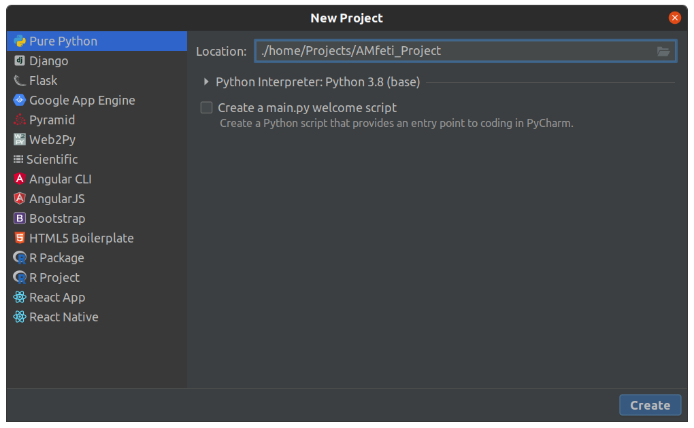

============
Installation
============

| The installation process depends heavily on the background and the goals of the user.

For **beginners**, we highly recommend following this guide and getting the out-of-the-box
AMfeti installation.

Step-by-step guide
-------------------

For **beginners** we highly recommend following the
:ref:`pre-installation guide <pre_installation_steps.rst>` before installing AMfeti.
We provide a step-by-step guide also suitable for people with no experience with
environments, Git-repositories or using IDEs.

After the pre-installation, your operating system is ready to install and then use AMfeti.
We recommend that you create a virtual environment for your AMfeti installation as this will
prohibit problems with package dependencies and conflicting versions of Python
for other frameworks that you might be using now or in the future.

*Note: The steps we are going to show can also be done from the command
line of your operating system, however, make sure that you are in the
directory where you want these files to be stored and activate your virtual
environment (e.g. ``source activate python37`` where **python37** is
the name of the virtual environment).*

Our guide will be using PyCharm Professional and Anaconda specifically.

We start by setting up a new project in PyCharm. If this is your first
time using PyCharm, the New Project button will be visible at the
startup of PyCharm. Otherwise, you can always create new projects
in PyCharm under the **File -> New Project** tab

| In the location field, you can choose a directory for storing your project. The name of the project will correspond to the name of the folder created. We chose *AMfeti_project* as a name here. Don't create the project just yet, as we want to create a virtual environment for the project as well.

| For the virtual environment, we choose a Conda (Anaconda) environment with the Python version 3.7. Always make sure to select a Python version that is 3.7 or newer.
You can now click on the **Create** button and with that the new project will be created.

| We have now created our AMfeti_Project and we can proceed with getting the Git-repository. For this we will open the Terminal (found on the bottom row in PyCharm) and use the command

``git clone https://github.com/AppliedMechanics/AMfeti``

| Afterwards, you will be able to see that the repository has been copied in your project.

| You can now navigate to the AMfeti directory in the terminal by using the command

``cd AMfeti/``

and setup AMfeti with the command

``python conda_setup.py``

| After all packages have been installed we use the command

``python setup.py install``

to finish our installation.

| **Note: Developers are encouraged to use**

``python setup.py develop``

**here because it allows them to change source code.**

After following these steps, you should be ready to use
AMfeti as a Python-library in your scripts.

We also recommend to do the
:ref:`post-installation steps<post_installation_steps.rst>`
to make sure that everything has been installed and is now working properly.

Notes for intermediate and advanced users
------------------------------------------

For **intermediate and advanced users** we suggest installing
a developer version of AMfeti and share
AMfeti development practices in the
:ref:`Implementation Details and Requirements chapter <implementation_details_and_requirements>` .
