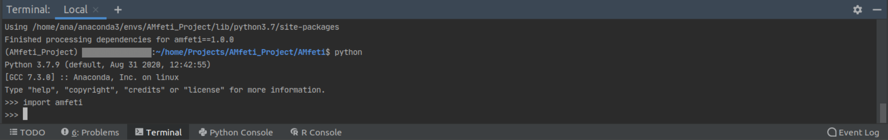
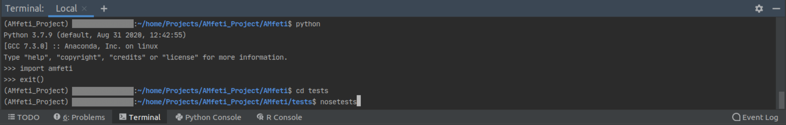

.. _post_installation_steps.rst:

=========================
Post- Installation Guide
=========================

After you have installed AMfeti, it is recommended that you check if everything
was done properly during installation, so that you don't encounter issues when
using the AMfeti framework later.
A basic check is to open Python in the terminal and import the AMfeti package.

>>> python
>>> import amfeti

If everything works fine, you shouldn't get any error messages.

| You can now exit Python with

>>> exit()

and continue with running the tests.

Run AMfeti Tests
----------------

Unittests aim to cover all source files.
You can run the Unittests by navigating to the tests directory
and running the nosetests command:

>>> cd tests
>>> nosetests

| You should then get an output that shows the number of failed tests.
Ideally, there will be 0 failed tests.

Further Recommendations
------------------------

For the pre-processing steps and some convenient tools
that might be needed, we recommend considering the installation
of `AMfe <https://github.com/AppliedMechanics/AMfe#documentation>`_.
AMfe provides a powerful finite element
framework for research purposes.

