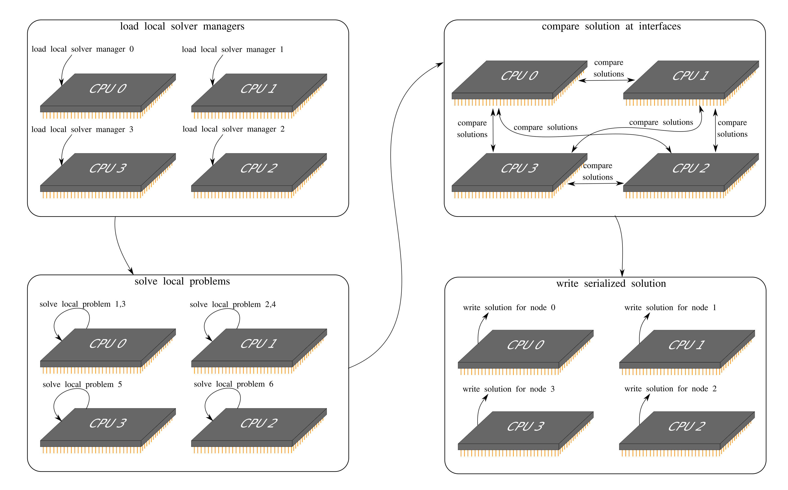

Parallelization
================

One of the key characteristics of AMfeti is the ability to solve the problem for each substructure
on a separate processing unit. This is done by solving the problem for all substructures in parallel and
exchanging information for the solutions at interfaces at every iteration. In this section, we
will explain how the parallelization in AMfeti works. The goal is to give interested readers an introduction
to the inner processes of AMfeti and to enable developers to further contribute to this project.

First, we can look at a code-snippet showing how to manage the parallelization process when solving
a problem with AMfeti:

.. code-block:: python

    mpi_manager = MPIManager()
    mpi_manager.set_config({'mpi_rank2problems': {0: np.array([1, 3]),
                                                  1: np.array([2, 4]),
                                                  2: np.array([5]),
                                                  3: np.array([6])}})
    solver_manager = ParallelSolverManager(fetisolver._local_problems, fetisolver._config_dict['global_solver'])
    solver_manager.set_config({'parallelization_manager': mpi_manager})

This code-snippet is allocating six substructures (1 to 6) on four processing units (0 to 3).
In particular, the first and third substructure are on the 0th processing unit, the second
and fourth substructures are on the 1st processing unit, the fifth substructure is on the 2nd
processing unit and the sixth substructure is on the 3rd processing unit.

The MPI (Message Passing Interface) manager used in AMfeti assumes that the number of available processing units corresponds to
the number of substructures in the system. So for a machine with six processing units, the code-snippet shown
above could be avoided and each substructure would be allocated to a separate processing unit. If the
number of available processing units does not correspond to the number of substructures, then the
user needs to map each substructure to a processing unit that will be solving it. Note that one processing
unit can handle multiple substructures but a single substructure cannot be distributed over multiple
processing units.

Since Python is an interpreted programming language, the parallelization process is not very straightforward
and requires additional special scripts that manage every run individually. A MPI (parallelization) manager
manages the whole process. The parallelization manager creates a temporary folder, which will be used to
store temporary solution files, keep the details of each local problem, log the MPI output
and execute the Python scripts during runtime. This folder is
deleted by default after the final solution has been obtained, but the user has an option to keep
this folder by setting the remove flag to ``False`` in the parallelization manager. The folder is created
in the same folder as AMfeti script that contains the problem we are solving and is called ``tmp`` by
default. The script used to run local problems on separate processing units is a separate script titled
``run_mpi`` and is either a shell script (on Linux) or a batch file (on Windows). This script simply
does an MPI execution of predefined scripts by running ``mpiexec -n *number of processor* python *Python-script*``,
provides a path for saving the solution files and
logs the MPI output in a separate file.

A developer must take good care of the ``mpi_local_processor.py`` script in order to be able to debug
the code, as it is the only script that imports the MPI library ``mpi4py``.
Note, that as soon as the MPI-process is launched, there is a significant difficulty in the debugging
process, as most standard Python-debuggers don't support parallel debugging. Once
the MPI module starts to run processes in parallel, a debugger cannot provide information
on the current states. For debugging within the MPI module, the developers should use the logged output.

The main tasks of the local MPI processor, found in the ``mpi_local_processor.py`` script, include
starting the parallel process on the different CPU nodes, loading the solver manager, solving the
problem and storing the solution.

The workflow for a simple static linear problem is shown in the illustration below.

The local MPI processor script should be only called by an MPI-node and should not be imported anywhere
else, because importing the MPI module could call MPI-commands (e.g. ``MPI.COMM_WORLD``) that can only be called
if an MPI-node is launched. It is important that the MPI module is imported only in this particular script, which
is only called when an MPI-node is launched. If the MPI is not launched, Python won't recognize the MPI commands
and will crash. As Python imports everything in the ``init``-files, when AMfeti is imported in a script,
no MPI-commands may be present in such an imported script.

The parallel solving process is illustrated below.

After initializing the parallel process by starting the available CPUs, the local solver manager
is loaded on the respective CPU and then the problems are solved. After each step of the solution, the
CPUs compare their solutions. In particular, they exchange interface-dictionaries and gaps over
a messaging system. The solutions at each step are stored and used to compute
the solution for the next step. Once the convergence criterion is met, the final solution
is stored separately. Each CPU runs its own global iterative-solver and orthogonalization of
search-directions, respectively. They just exchange local interface-solutions to assemble their
search-directions locally. So, at this point it is crucial that all interface-solutions are
exchanged, sо that all CPUs have the same assembled search-directions.

When solving dynamic and nonlinear problems, the solution process we described above restarts for every
iteration. We are aware that this approach can be optimized and are looking for a more efficient solution
approach for nonlinear and dynamic problems.